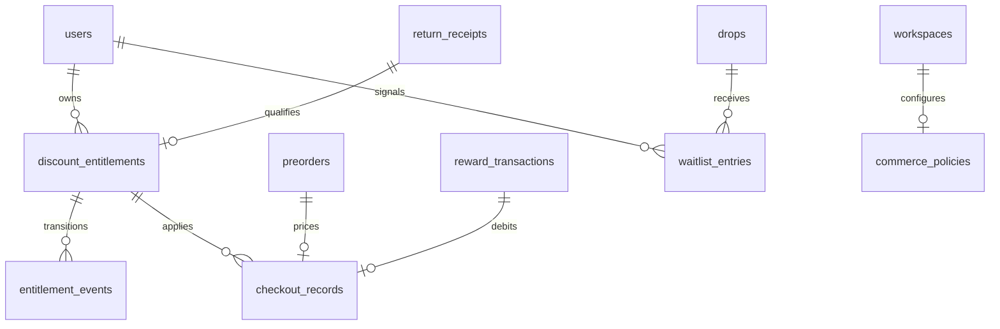

# Reversal accounting and physical material model

## Immutable history and derived balances

Every new accounting command has a UUID idempotency key, actor, workspace and reason. The command and its business records commit in the same transaction. Reusing a key returns a conflict, including concurrent retries; a rejected command rolls back completely. Existing workspace transaction locks remain, with PostgreSQL source/user locks and constraints as additional protection.

Original material movements, receipts, reward entries and consumption records cannot be updated or deleted. Reversals reference originals through foreign keys:

| Event | Original reference | Effect |
|---|---|---|
| `allocation_releases` | original drop allocation → material movement | Frees only the unreleased, unconsumed reservation |
| `preorder_events` | original preorder | Records previous/next lifecycle state |
| `reward_transactions` reverse | `original_transaction_id` | Exact signed opposite of original earn, redeem or expire |
| `production_cancellations` | original production run | Cancels a planned/approved commitment and releases its reservations |
| `return_corrections` | original inspected receipt | Voids the accepted source after reservation and reward reversals |

`source balance = opening verified kg − original allocated kg + released kg − corrected receipt kg`.

`effective drop allocation = original allocation − all releases`.

`credit balance = SUM(all signed reward transactions)`.

Pool entries document new residual creation, not an additional debit. Histories display original, released and net kilograms. A release is not new recovered material. Its counterpart source is the same original source. A completed production's recoverable residual is a **new** source linked to the run and original allocation.

Partial releases are allowed up to the original remaining reservation; the same command cannot be replayed. Multiple records within a cancellation cascade may refer to the same allocation, but their sum remains bounded. All state-changing API commands create audit events.

## Preorder lifecycle

Creation supports `pending` or `confirmed` (the short demo still creates confirmed simulated orders). Allowed subsequent transitions:

```text
pending → confirmed | failed | cancelled
confirmed → cancelled
cancelled → refunded
```

Only `confirmed` contributes to demand or current committed gross sales. Unit price, owner and original quantity remain immutable. `preorder_events` drives the current status projection. Duplicate transitions are rejected. One order identity per consumer/drop remains; a cancelled identity is not silently recreated.

Cancelling confirmed demand rechecks readiness immediately. If a **planned** run is no longer supportable (below threshold, above remaining demand, or missing capacity), it is cancelled by an audited system cascade and its recovered/auxiliary reservations released. Its original quantities and price remain in history. The drop returns to market testing and can unlock a new plan after new valid commitments and allocations.

After **approval**, cancellation creates a business exception and blocks starting if the remaining commitments cannot support the plan. A brand can explicitly cancel the approved run. After **in_production**, demand cancellation records the exception without restoring any material or cancelling manufacturing. Completion must reconcile physical material. Completed runs cannot be cancelled. Historical exceptions remain visible even after reconciliation.

## Explicit BOM

Recipes own immutable component records with unit (`kg` or `each`), requirement per produced unit, mass per component unit, recovered/non-recovered classification and accepted grades. Existing material requirements remain the recovered-component reservation interface. Auxiliary requirements use separate supplier stock sources, allocations, releases and consumption records.

The calibrated Utility Bag BOM is:

| Component | Per product | Source | Seed reservation |
|---|---:|---|---:|
| Cotton Denim | 1 kg | recovered fabric | 41.2 → 42 kg |
| Lining | 0.18 kg | simulated supplier | 12.24 kg |
| Zipper | 1 each, 0.01 kg each | simulated supplier | 68 each |
| Hardware | 2 each, 0.005 kg each | simulated supplier | 136 each |

The 1 kg recovered-denim allowance preserves the existing calibrated demo; it is not a validated cutting pattern. Auxiliary stock is not counted as recovered denim. Supplier and residual stock can be reserved separately through optional accounting controls. A source cannot supply multiple drops with the same units. Each-based inputs must be integers.

`capacity = MIN(FLOOR(available component / per-product requirement))` across recovered **and** auxiliary components. Every required component must cover the **planned quantity**, not maximum stock. Before commitment, `planned units = max(maker minimum, confirmed orders)`; the Utility Bag starts at 42. After commitment, the active immutable production run determines planned units. For 42 units: 42 kg denim, 7.56 kg lining, 42 zippers and 84 hardware pieces. For 50 units: 50 kg denim, 9 kg lining, 50 zippers and 100 hardware pieces. Required kg is rounded up to 0.001 kg. Confirmed demand must fit verified capacity. Maximum recovered-material allowances preserve the 68-unit batch ceiling, independently of readiness. The legacy `minimum_kg` column is retained for compatibility but is no longer a readiness gate; `required_kg` and auxiliary `required_quantity` are derived. PostgreSQL `component_readiness.minimum_quantity` also derives the planned requirement.

Existing historical/started runs are not retroactively given extra physical inputs. The migration adds auxiliary requirements and labelled simulated stock only to eligible existing demo drops. New seeded runs always include the full BOM. Newly generated non-Utility recipes retain their explicit registered recovered-material BOM; additional real manufacturer specifications remain future work.

## Inspected quality

Verified sources record controlled values:

- Grade: A, B, C, fibre_only.
- Composition: cotton_rich, cotton_blend, synthetic, unknown.
- Colour: blue, dark, light, mixed, unknown.
- Fabric weight class: light, medium, heavy, unknown.
- Panels: large, small, fibre_only.
- Contamination: clean, requires_cleaning, contaminated.

Utility Bag and Jacket accept A/B; the Small Pouch accepts A/B/C. Material compatibility **and** accepted grade, clean status, suitable panels and cotton composition must pass. Unknown/contaminated/fibre-only sources cannot enter current product recipes. Colour and fabric weight are recorded descriptors, not invented compatibility restrictions.

Before inspection, the existing wardrobe match explicitly states its provisional grade B assumption. After inspection, matching reads stored verified attributes through `/api/returns/:id/matches`. AI/item confirmation endpoints reject injected quality fields. The separate human inspection form allows corrections; quality on receipts/sources then becomes immutable. Residuals retain their source quality and lineage. Defaults and legacy attributes are labelled prototype assumptions; they do not prove physical testing.

## Production mass balance

Completion appends per-allocation recovered and auxiliary consumption, then one `production_mass_balances` record. It requires:

```text
allocated input = consumed input + recoverable residual + non-recoverable residual
```

Tolerance is **0.001 kg**. PostgreSQL compares the statement with the actual component ledger; a balanced but fabricated summary is rejected. Consumption cannot exceed its allocation. Non-recoverable material remains a recorded debit/loss and never becomes stock.

**Process scrap is a subset of residual**, not an extra additive term. Explicit non-recoverable scrap must be no greater than process scrap; scrap cannot exceed unused recovered input. The prototype currently attributes entered scrap/loss to recovered fabric, while auxiliaries use exact recipe consumption and reusable leftovers. Default completion assumes zero declared scrap/loss. Real-world measured reconciliation would require maker measurements and a richer per-component process model.

Default complete run:

- Recovered fabric: 42 kg input = 42 kg consumed + 0 kg recoverable residual.
- Auxiliaries: 13.6 kg input = 8.4 kg consumed + 5.2 kg reusable stock.
- Total: **55.6 = 50.4 + 5.2 + 0 kg**.

In a separate surplus test, explicitly allocate 26 kg extra denim before unlock. With 3 kg declared scrap, including 2 kg non-recoverable:

- Total: **81.6 = 50.4 + 29.2 + 2 kg**.
- Scrap 3 kg is included inside the two residual categories.

Recoverable fabric creates new `material_sources`; reusable auxiliary leftovers create new `auxiliary_sources`. Both can fund future production. No environmental benefit or CO2 saving is inferred from either category.

## Rewards and corrections

Existing base/bonus entries retain their original types and expose lifecycle **earn**. New signed entries support **redeem**, **reverse**, **expire**. The small UI redemption deducts 50 simulated credits; it creates no actual voucher or payment. Admins can reverse a transaction or record a bounded expiry. PostgreSQL locks the consumer balance and rejects overdrafts and duplicate reversals, even without the service's workspace lock.

A reversal offsets the full original amount. Expiry may partially debit an earn, bounded by its remaining unexpired amount; reversing an expiry restores that amount's availability. Earn/bonus uniqueness per receipt remains. No negative balance policy is enabled.

Return correction is a **full void of an accepted inspection**, not an edit of old measured kilograms. It atomically releases legally releasable material, reverses active expirations and earnings, and records a receipt correction. It rejects material committed to approved/started/completed production or spent credits that cannot be reversed. An approved run must be explicitly cancelled first. A new inspection requires a new reviewed item/return. Rejected receipts have nothing to credit or reverse. This conservative state-machine rule does not imply jurisdiction-specific legal advice.

## Additional APIs

All are POST, locally scoped, runtime validated, role/ownership checked and audited:

- `/api/preorders/:id/confirm|cancel|refund|fail`
- `/api/allocations/:id/release` with kg
- `/api/production-runs/:id/cancel`
- `/api/production-runs/:id/complete` with optional `processScrapKg`, `nonRecoverableKg`, command key/reason
- `/api/returns/:id/correct`
- `/api/returns/:id/matches` (read-only matching via existing POST boundary)
- `/api/rewards/redeem` with amount
- `/api/rewards/:id/reverse|expire`
- `/api/drops/:id/receive-auxiliary|allocate-auxiliary`

New reversal/redemption/supply operations require `{ requestKey: UUID, reason: string }`. Legacy completion with `{}` remains supported; its unique final mass statement prevents replay. No external payment, collection or reward API is called.

## Database invariants

- Immutable ledger rows and typed original references.
- Material release ≤ remaining original allocation; source balance cannot become negative.
- All component capacities and required minima enforced before planning, approval and start.
- Grade/composition/cleanliness checks on recovered allocations.
- Unique preorder target transitions; status changes require immutable events.
- One active production run per drop; cancelled history retained.
- No cancellation of started/completed production; no release of committed input.
- Unique receipt earnings; unique reversal per original; nonnegative signed reward balance.
- Per-allocation consumption reconciliation and total mass statement checked in PostgreSQL.
- Idempotent command keys, transactional rollback and audit history.

The app remains a localhost demo with simulated identity selection. These accounting controls improve internal integrity; they do not supply production authentication, legal return policies, actual supplier verification or a validated manufacturing model.

## Readiness migration

Migration 011 replaces production guards and the component-readiness view. It never modifies committed allocations, receipts, rewards or historical run quantities. New demo seeds allocate 34 kg from D102 plus 7.2 kg from previous returns. A verified 0.8 kg return supplies the 42-unit plan. Existing 67.2 kg allocations already satisfy that plan and must not advertise a further shortage. Matching/rewards use the plan shortage; extra allocations up to material maximum remain possible for explicit surplus/residual scenarios.

Production planning commits all current confirmed orders, with at least the maker minimum. Supplying a smaller `units` value cannot bypass an unmet plan. PostgreSQL independently rejects such inserts. A cancellation before commitment recalculates the target; after commitment it does not silently resize a run. Both approval and start check the fixed run quantity against each BOM component.


## V7 checkout accounting (migrations 012–014)



Checkout amounts and exchange-policy snapshots are immutable; only lifecycle status changes. `price_cents = discount_cents + credit_cents + payable_cents`. Default stacking cap: 25%. Credit redemption rounds down to whole cents; sub-cent redemptions are rejected. Financial summaries count only confirmed orders and distinguish original merchandise value from net simulated commitments.

Brand scenario accounting deducts return discounts and expected redeemed-credit value from sales exactly once, then subtracts separately entered relevant operating costs. The conventional baseline uses its own entered units; the circular forecast alone is capped by verified material capacity. Break-even above that capacity is identified as unreachable under current constraints, and a zero-net-sales contribution margin is undefined rather than reported as zero. Unredeemed wallet credits remain outside the automatic forecast and must not be duplicated under other costs when expected redemption is entered.

Migration 014 independently enforces the permitted checkout transitions, exact credit exchange arithmetic, entitlement-backed discount arithmetic, recipe/owner/workspace links and deferred end-of-transaction consistency between checkout, preorder, credit reversal and entitlement state. Direct SQL cannot revive a terminal checkout, reserve an unlinked entitlement, invent a discount, or assign a different monetary value to redeemed credits.

A reserved checkout writes a negative `redeem` reward transaction. Cancellation/failure writes an equal positive `reverse` referencing it. Existing reward guards prevent negative balances and duplicate reversals. Workspace serialization, row locks, unique receipt grants, unique preorder checkouts and command keys prevent repeated spending. Direct preorder state changes go through the same checkout reconciliation hook. Approved or started production is not automatically cancelled by consumer cancellation; existing business exceptions remain.

GMV is original order price × confirmed units. Return discounts and redeemed-credit value reduce net simulated sales once. Simulated cash payable equals the checkout net amount; it is not realized revenue. Contribution profit is a forecast: net simulated sales minus the entered fixed and per-unit assumptions. Preparation and cancellation-risk allowances are explicit inputs alongside collection, inspection, auxiliaries, manufacturing, logistics, platform fees and setup. A zero input means the cost is not included and remains unverified.

Recovered-material stock is brand-authorized. Every source owner is derived from immutable inventory, return-target or residual-run lineage. Shortage and bonus calculations subtract only verified allocation and compatible available sources authorized for that Drop brand. PostgreSQL rejects a source-to-Drop movement when those brands differ. No cross-brand loyalty settlement or material marketplace accounting is implemented.

Entitlement states: available -> reserved -> redeemed. Cancellation/failure returns eligibility to available when still valid, otherwise revoked. Original receipt and expiry are unchanged; each transition is append-logged. Return correction is blocked while its discount is in use. Expired reserved checkouts must be explicitly cancelled from the wallet; no automatic background sweeper is claimed.

Materials Wanted quotes subtract compatible stock before offering bonuses. V7 base-return earnings and capped shortage bonuses are independently recorded. The default seed has 108 kg of compatible free brand stock, so no new shortage bonus is due for the default return. Historical 180-credit grants are not edited; current grants are 100 base credits for a qualified 0.8 kg return. The old default test expectations change to reflect this documented correctness fix, with all original scenarios retained.

`material_bonus_balances` recursively follows every adjustment from each original bonus, including an expiration, reversal of that expiration and final earning reversal. Both UI quote budgets and the database budget trigger sum those rooted balances. Net material-bonus budget utilization therefore comes from the full immutable ledger rather than only one generation of references. It is a prototype issuance guard, not a full accounting valuation of outstanding wallet-credit liabilities.

Community totals exclude return corrections and cancelled production. No carbon or diversion benefit is inferred from financial or mass ledgers. Margin scenarios are explicit forecasts; stock capacity and observed demand are context, never evidence that forecast sales or profit have occurred.
