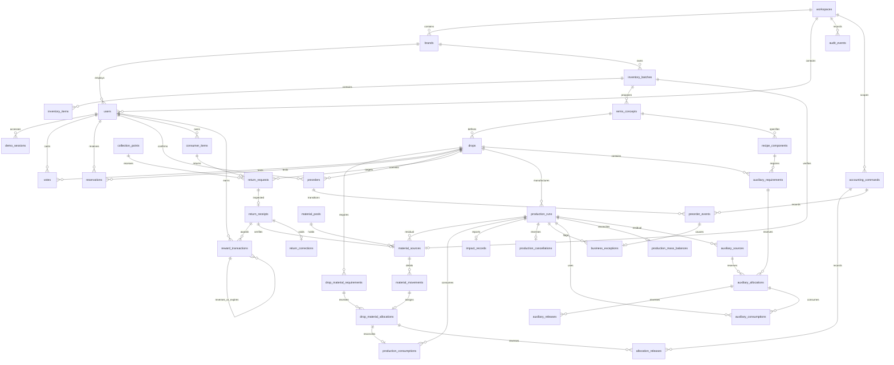

# Persistent Remix Loop architecture

```text
Next.js / React (draft inputs and navigation only)
  ↓ same-origin API + HttpOnly local demo session
Zod validation / ownership / explicit transition guards
  ↓
Existing circular, Remix, economics, matching and rewards engines
  ↓
Transactional domain service / audit / immutable ledgers
  ↓
PostgreSQL (authoritative source inputs, verified material, commitments)
```

AI = interpretation. Domain engines = calculation. Database = authoritative state.
Ledger = material/reward traceability. Consumers = demand validation.

## ERD



## Material accounting

`material_sources` is the verified opening balance with exactly one typed origin: brand batch, accepted receipt or production residual. `material_movements` is append-only; positive kilograms debit a source when allocated. The foreign key supplies source type and material without copying mutable strings into every movement. A residual `pool_entry` documents its new opening balance and does not debit it again.

`source_balances = verified_kg − posted allocation outflows + immutable releases − voided receipt kg`. Inventory histories aggregate this ledger. Reservations and estimates never appear in it. A drop allocation also references an explicit component requirement. Multiple components are supported by schema/service; the UI remains single-fabric focused. All component minimums must be met; capacity is the minimum of each component's floor(allocated kg / recipe kg per unit).

Completion records consumption per allocation. Each unused portion becomes a new residual source linked to the production run and future pool. Original sources stay spent; residuals are available for later drops without resurrecting original kilograms. Return completion waits until all of its allocated drops complete and no verified source balance remains.

Transactions take a workspace advisory lock (simple, deliberately coarse local-demo concurrency), then row locks and database checks. Source-balance and requirement triggers defend against concurrent overdraw. Unique keys protect receipt, reward type per receipt, consumer/drop preorder, production run per drop, allocation idempotency key and consumption per allocation. Failed operations roll back audits and business writes together. Duplicate calls return conflict rather than creating a second record.

## State transitions

- Inventory: draft → analysed → route_selected → partially_allocated / allocated → closed. Allocated batches cannot be edited in place. Corrected inputs create a new batch.
- Return: reserved → received → inspected → accepted / partially_accepted / rejected → allocated → completed. Creation reserves directly; draft exists in the schema for future editing. Receipt, inspection, source creation and rewards are distinct from reservation. Inspection and accepted state are committed atomically with an audit of the inspected step.
- Drop: draft → market_test → unlocked → production → completed. During market_test, demand_ready, material_ready and ready_to_unlock are derived, never independently editable flags. Preorder states are pending/confirmed/cancelled/refunded/failed. Unsupported planned runs are cancelled and readiness revoked; approved/started demand changes create business exceptions.
- Production: planned → approved → in_production → completed. Unlock creates exactly one planned run atomically. Planned/approved runs may instead become cancelled through referenced reversal records and reservation releases. Started runs require physical reconciliation. Each operation checks previous state and ownership.

Unlock requires confirmed demand ≥ maker minimum, every verified material minimum, and demand ≤ material capacity. Planned quantity cannot exceed demand or capacity. Price and cost are taken from the registered concept. Committed gross sales are stored order prices summed; no profit is claimed.

## API

All mutations are POST with strict JSON schemas; GET `/api/snapshot` returns a consistent repeatable-read view. Credentials are server-only. IDs are UUIDs. Invalid fields get 400, permission failures 403, duplicate/conflicting state 409.

| Endpoint | Role / purpose |
|---|---|
| `/api/inventory` | Brand/admin: new source inputs |
| `/api/inventory/:id/analyse` | Brand/admin: deterministic route analysis |
| `/api/inventory/:id/select-route` | Brand/admin: viable route selection |
| `/api/inventory/:id/verify` | Brand/admin: explicit simulated inspection |
| `/api/inventory/:id/concepts` | Brand/admin: deterministic recipe validation |
| `/api/consumer-items`, `/api/matches` | Consumer/admin: reviewed estimates / matching |
| `/api/returns` | Consumer/admin: reserve, zero credited material |
| `/api/returns/:id/receive` | Owner/admin: simulated physical receipt |
| `/api/returns/:id/inspect` | Admin: accepted, partial or rejected inspection |
| `/api/returns/:id/simulate-inspection` | Owner/admin: explicit rule-derived demo inspection |
| `/api/drops` | Brand/admin: create from approved concept and available verified material |
| `/api/drops/:id/vote`, `/reserve`, `/preorder` | Consumer/admin: unique demand events |
| `/api/drops/:id/allocate-material` | Authorized source/destination owner: atomic allocation |
| `/api/drops/:id/unlock` | Brand/admin: both gates and capacity checked |
| `/api/production-runs` | Brand/admin: plan within demand and capacity |
| `/api/production-runs/:id/approve`, `/start`, `/complete` | Brand/admin: production lifecycle |
| `/api/session`, `/api/workspace`, `/api/demo-reset` | Local demo identities / saved runs / isolated fresh seed |

The Demo Operator automatically requests unlock when both gates are ready to preserve the three-minute story. This is still a server-validated transition; a consumer cannot approve production. Snapshots poll every five seconds and on focus. React retains forms/navigation, not authoritative business records.

## Trust boundary and limitations

The localhost-only demo uses random HttpOnly session tokens and server-side role/ownership checks. Its identity selector intentionally permits local impersonation of three seeded roles. It is **not production authentication** and must not be exposed publicly. PostgreSQL access is through the server; no browser service key or anonymous database access is provided. Supabase RLS/auth and production deployment are outside this iteration.

AI writes only suggestions. Strict domain payloads reject injected verified kilograms, prices, rewards, capacities or unlock flags. Human confirmation of extraction is still an estimate; an explicit inspection operation creates verified-in-demo material. Nothing here proves a real physical inspection or lifecycle benefit.

Immutable reversals, simulated reward redemption and bounded production cancellation are implemented; physical logistics and real payments remain out of scope. No CO2 claim. Local fixtures and tests retain prior pure simulation helpers, but the running app uses the PostgreSQL service exclusively for domain mutations.


## Accounting extension

See [accounting specification](accounting.md) for all reversal APIs, order state transitions, quality enums, calibrated recipe BOM, auxiliary ledgers and the mass reconciliation equation. Migrations preserve legacy quantities and completed histories. Current balances are computed over original and reversal records, never from React state.
